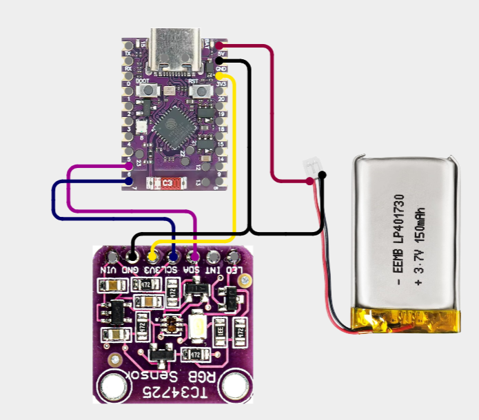

# 🌟 DermaScan - AI-Powered Skin Cancer Detection 🩺
**A submission for Google JuaraGCP / Juara Coding Vibes Competition**

DermaScan is an advanced, AI-driven healthcare web application designed to help users detect potential skin cancer risks early, consult with an intelligent medical AI assistant, locate specialized clinics, and track diagnostic history with seamless IoT integration.

Built to demonstrate the power of the modern Google tech and AI ecosystem!

---

## 🚀 Features

### 1. 🔍 YOLO Skin Cancer Scanner (Real-time Vision AI)
Upload an image or use your device's camera (via WebRTC) to instantly scan skin lesions. Powered by a custom **YOLOv12** computer vision model hosted on **Google Cloud Run**, it detects:
- 🔴 `Basal Cell Carcinoma`
- 🔴 `Melanoma`
- 🔴 `Squamous Cell Carcinoma`

It instantly provides bounding box visual feedback and confidence scores right in the browser!

### 2. 🤖 AI Consultant (Powered by Gemini)
Got questions about your skin health? Our interactive AI consultant uses **Google Gemini (AI Studio)** to analyze your symptoms, provide contextual medical advice, and guide you on what steps to take next. 
- **Combined Analysis:** Users can consult visual scanner results and color pigmentation differences from the IoT sensor combined in a single consultation session for comprehensive feedback.

### 3. 🔐 Firebase Auth & Cloud Firestore (Medical Logs & History)
Securely save and access diagnostic results from anywhere:
- **Firebase Authentication:** Handles user authentication, including sign-up, sign-in, and instant display name changes.
- **Cloud Firestore:** A NoSQL database that logs diagnostic data per-user under `users/{userId}/history/{historyId}`.
- **Medical History Drawer:** Users can open a slide-over drawer in their Profile to view a visual timeline of their past YOLO scans and color sensor measurements. Each card includes a direct shortcut button to consult specific historical scan results with the Gemini AI.

### 4. 🗺️ Smart Clinic Locator (Google Maps)
If a risk is detected, DermaScan helps you take immediate action. Integrated directly with **Google Maps Platform (Places API & Routes API)**, the application automatically maps out the nearest specialized clinics, displaying accurate ratings, distance, and live driving routes.

### 5. ⌚ IoT Integration & Hardware Schematic
We have fully integrated a custom IoT hardware module powered by the **ESP32-C3 Super Mini** microcontroller and a **TCS34725 Color Sensor**. 
- **Mechanism:** The sensor captures the baseline RGB color of healthy skin and compares it against the RGB values of the targeted skin lesion/wound. This comparative color analysis helps determine the severity and potential risk of the lesion (Delta-E distance).
- **Secure Communication:** Data is transmitted to our web client via the **MQTT** protocol (HiveMQ public broker) over WebSockets, securely encrypted end-to-end using the lightweight **ASCON-128-AEAD** cryptographic algorithm (NIST Standard) to ensure patient data privacy.
- **Circuit Schematic Diagram:**
  Here is the wiring diagram to connect the TCS34725 color sensor to the ESP32-C3 Super Mini microcontroller:
  
  

---

## 💻 Technology Stack

This project was crafted to fully utilize the Google Cloud and AI ecosystem, seamlessly blended with modern web development frameworks.

**Frontend:**
- **Next.js 16** (App Router)
- **TypeScript** & **Tailwind CSS**
- **Framer Motion** (Premium animations)
- **React Markdown** & **Lucide React** (Icons)

**Backend & AI:**
- **Google Cloud Run** (Serverless container deployment for FastAPI + ML models)
- **Google AI Studio / Gemini API** (LLM conversational agent)
- **Firebase Auth & Cloud Firestore** (Authentication & database logs)
- **FastAPI** & **Ultralytics YOLO** (Computer Vision Backend)
- **Google Maps Platform** (Maps JavaScript, Places (New), and Routes API)
- **Google Antigravity Agent** (Agentic AI pair-programming assistant used to build this project!)

---

## 🛠️ How to Run Locally

### Prerequisites
- Node.js (v18+)
- Python (3.9+)
- Docker (optional, for local backend testing)

### 1. Frontend Setup
```bash
# Install dependencies
npm install

# Setup environment variables
# Edit .env.local and add your Google APIs and YOLO backend URL
# Example:
# NEXT_PUBLIC_GOOGLE_MAPS_API_KEY=AIzaSy...
# GEMINI_API_KEY=AIzaSy...
# NEXT_PUBLIC_YOLO_API_URL=https://your-cloud-run-url.app/predict
# NEXT_PUBLIC_FIREBASE_API_KEY=AIzaSy...
# NEXT_PUBLIC_FIREBASE_AUTH_DOMAIN=derma-scan-59f3.firebaseapp.com
# NEXT_PUBLIC_FIREBASE_PROJECT_ID=derma-scan-59f3
# NEXT_PUBLIC_FIREBASE_STORAGE_BUCKET=derma-scan-59f3.firebasestorage.app
# NEXT_PUBLIC_FIREBASE_MESSAGING_SENDER_ID=878884230254
# NEXT_PUBLIC_FIREBASE_APP_ID=1:878884230254:web:3f13be60dbb3ec13b8427f

# Run the development server
npm run dev
```

### 2. YOLO Backend Setup (FastAPI)
```bash
cd yolo-backend

# Install python dependencies
pip install -r requirements.txt

# Run the API locally
uvicorn main:app --host 0.0.0.0 --port 8080 --reload
```

---

*Built with ❤️ for Google Juara Vibes Coding Indonesia 2026*
